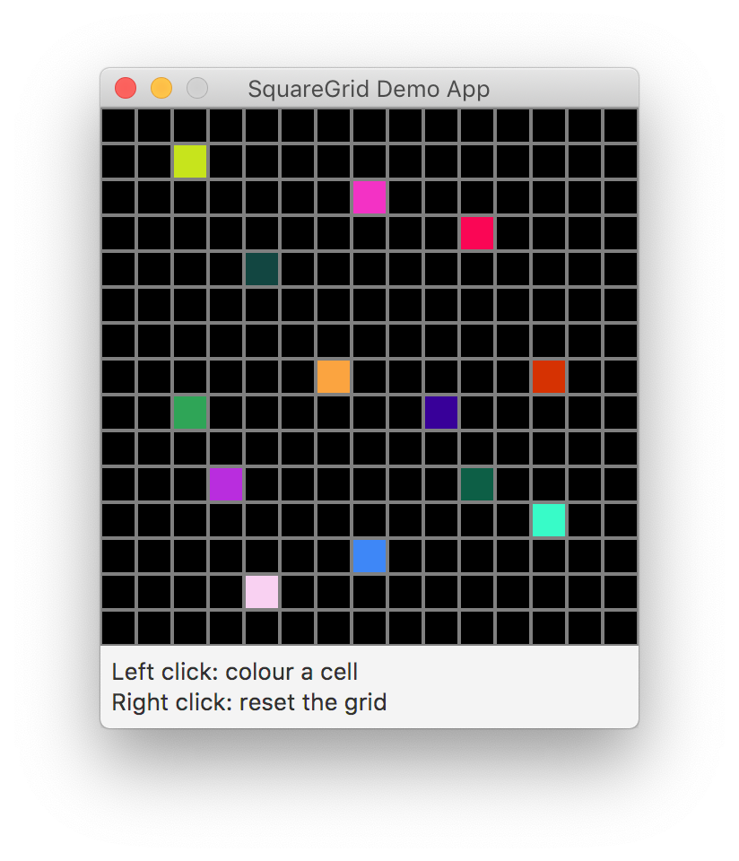

# SquareGrid

Currently there is no documentation. The source code of the SquareGrid class is pretty self-explanatory.

Check the demo app to get a basic idea on how to use this package.

### Projects using this class

 * [jTetris](https://github.com/SpinningVinyl/jTetris)

### License

This project is shared under the terms of [CC BY-NC-SA 4.0](https://creativecommons.org/licenses/by-nc-sa/4.0/) license.
